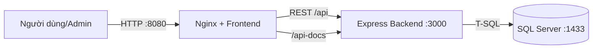
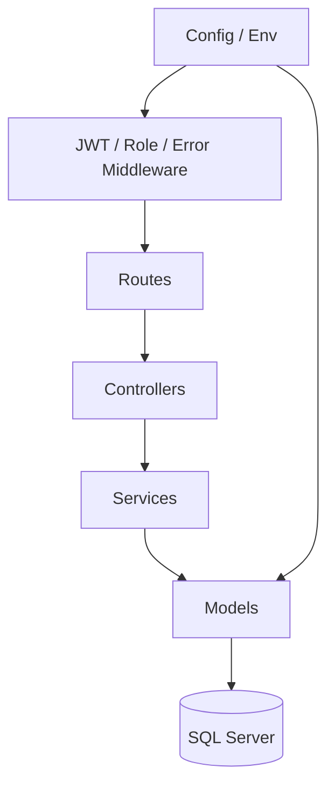

# Kiến trúc hệ thống

## Sơ đồ container

## Sơ đồ backend phân tầng

## Trách nhiệm

| Tầng | Trách nhiệm | Không nên chứa |
|---|---|---|
| Routes | URL, HTTP method, middleware | SQL, nghiệp vụ |
| Controllers | Đọc request, gọi service, trả response | Query database |
| Services | Validation, nghiệp vụ, orchestration | Chi tiết HTTP/Express |
| Models | SQL parameterized, transaction, mapping | UI hoặc response HTTP |
| Middleware | JWT, role, error handling | Nghiệp vụ sản phẩm/đơn hàng |

## Luồng tạo đơn an toàn

1. Frontend gửi Bearer token và danh sách `{productId, ml, quantity}`.
2. Middleware xác thực JWT.
3. Service validate dữ liệu và lấy `userId/email` từ token.
4. Model mở transaction ở mức `SERIALIZABLE`.
5. Backend khóa dòng tồn kho, đọc giá thật từ database.
6. Nếu đủ hàng, backend tính tổng, tạo order/items và trừ kho.
7. Commit; nếu lỗi thì rollback.

Điều này ngăn frontend tự sửa giá, tổng tiền, email hoặc user ID.
